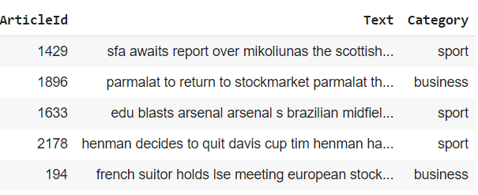
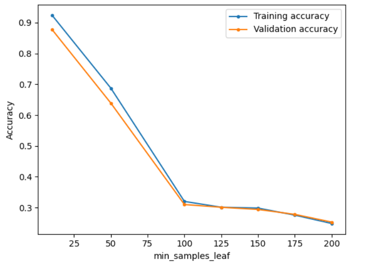
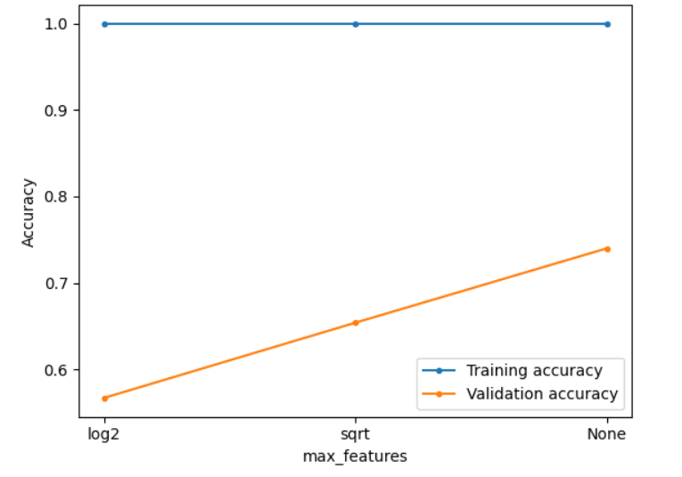
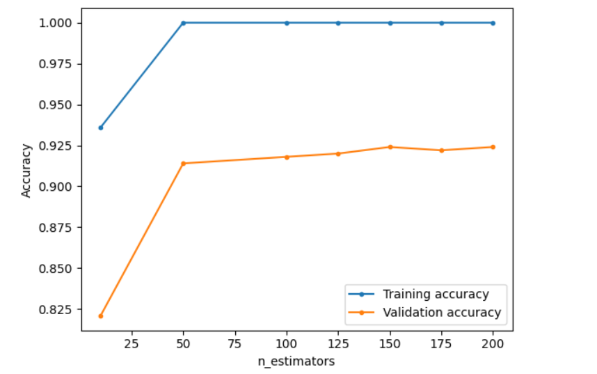
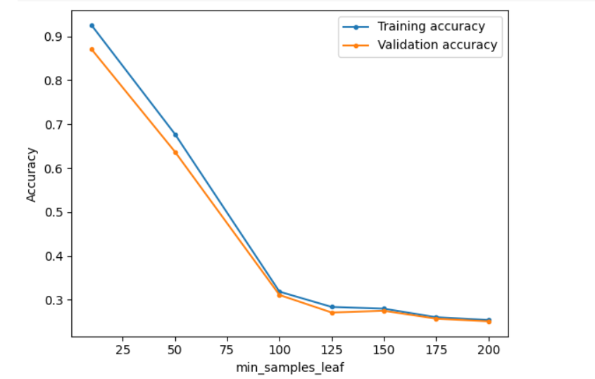

## Document Classification

This project involves a document classification task using a RandomForestClassifier and Multilayer neural network. The main goal is to categorize documents into 5 different classes based on their content. 

## DataSet
Text: Contains documents converted into text
Category: Classification of text into one of sport, business, tech, entertainment, politics categories

## Dataset

## Results

### Training and validation accuracy w.r.t # of min leaf samples in decision tree

### Training and validation accuracy w.r.t max features in decision tree

### Training and validation accuracy w.r.t # estimators in RF

### Training and validation accuracy w.r.t # of min leaf samples in random_forest

